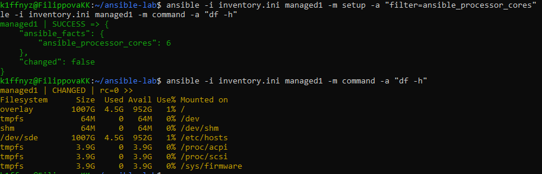
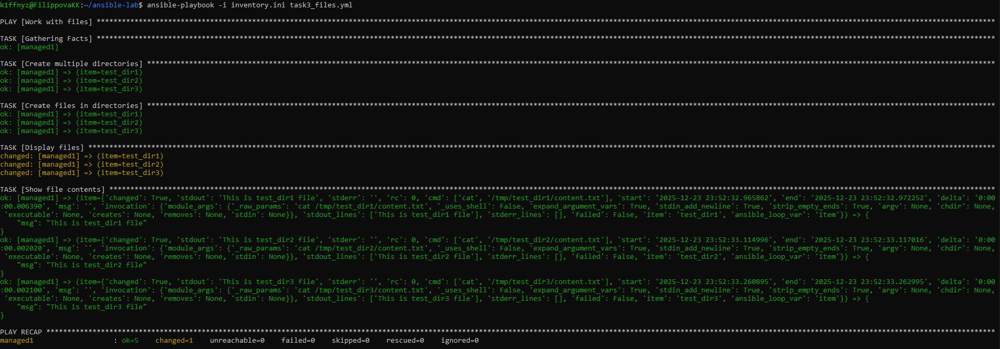
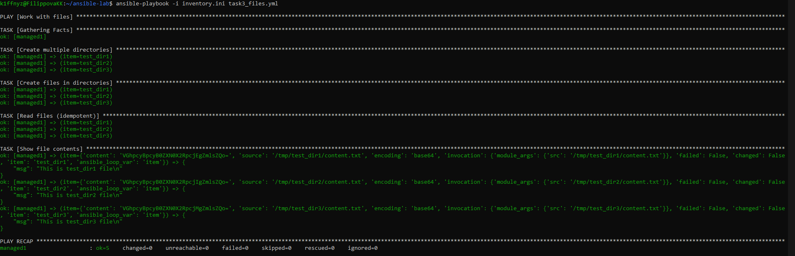
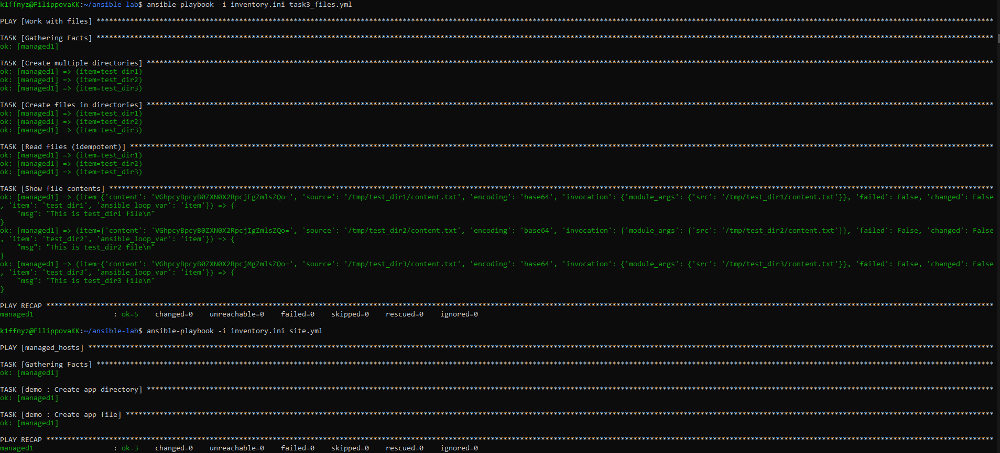

# Ansible Lab: Basics of DevOps Automation

## 📌 Описание проекта
Данный репозиторий содержит лабораторную работу по изучению **Ansible** — инструмента автоматизации и управления конфигурациями в DevOps.

В ходе лабораторной работы:
- настроено управление удалённым хостом по SSH
- использован Docker-контейнер как управляемый хост
- создан inventory Ansible
- выполнены ad-hoc команды
- реализованы playbook’и
- изучены variables, handlers и roles
- проверена идемпотентность Ansible

---

## 🛠 Используемые технологии
- Ansible
- Docker / Docker Compose
- Linux (Ubuntu / WSL)
- SSH (key-based authentication)
- YAML

---

## 📁 Структура проекта
```text
ansible-lab/
├── Dockerfile
├── README.md
├── docker-compose.yml
├── inventory.ini
├── handlers_example.yml
├── playbook.yml
├── site.yml
├── task3_files.yml
├── screenshots/
│ ├── 01_project_structure.png
│ ├── 02_docker_compose_ps.png
│ ├── 03_ssh_login.png
│ ├── 04_ansible_ping.png
│ ├── 05_ad_hoc_commands.png
│ ├── 06_playbook_run.png
│ ├── 07_idempotency.png
│ └── 08_role_execution.png
└── roles/
└── demo/
├── tasks/main.yml
├── handlers/main.yml
└── vars/main.yml
```


Проект имеет стандартную структуру Ansible и демонстрирует использование inventory, playbook’ов и roles.

---

## 📸 Скриншоты выполнения

### Структура проекта


### Запущенный Docker-контейнер


### SSH-подключение к управляемому хосту


### Проверка подключения Ansible (ping)


### Выполнение ad-hoc команд


### Выполнение Ansible playbook


### Проверка идемпотентности (changed=0)


### Выполнение playbook с role

